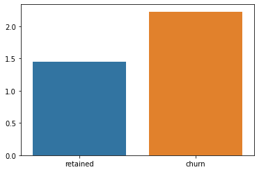
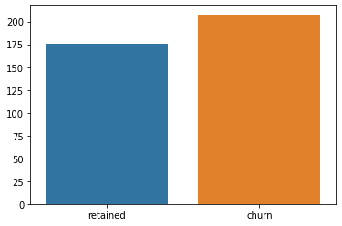
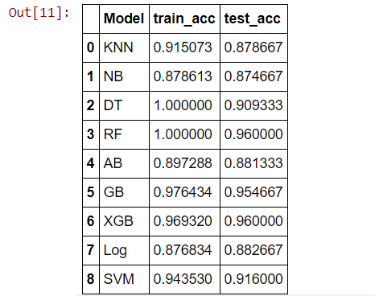
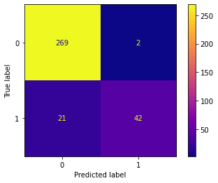
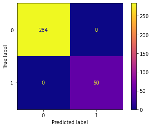
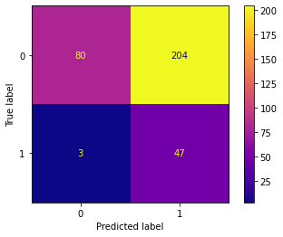

## Bussiness problem

The goal of this project is to use machine learning to predict customer churn, this way we are aware of what customers may leave in order to prevent customer churn. In this project I looked at SyriaTel’s customer data to predict churn, customers leaving the service. SyriaTel is a Syria based phone service provider, however we are only looking at the data of American customers. It should also be noted that the data is measured over the course of a month.

 

## Overview of notebooks and script
1. Phase3_EDA.ipynb: data exploration
2. Phase3_ModelBuilding.ipynb: model building
3. future_classifications.py: for making future predictions with the model, make sure you use 'FinalChurn.csv'

## EDA questions

1. What are the average day calls by region for churn customers?Compare these to non-churn customers?
2. What is the relationship between total charge and total minutes. is there a linear relationship between these variables? Do your findings reveal a unit price for call time?
3. How long is the average day call for churn customers as opposed to retained customers?
4. What features are strongly correlated with churn, what are these features strongly correlated with and what can we learn from this?

## Findings

1. Although there is no major difference, churn customers made fewer calls than retained customers in the Northwest and Southwest however retention and calls stayed the same in the Southeast and Midwest. Pay somewhat closer attention to customer's calls in the Western US as many churn customers there make slightly fewer day calls.
2. The results clearly show that the cost of call time is a fixed rate. Costing 17 cents an hour during the day, 9 cents an hour in the evening, and 5 cents an hour at night. This was helpful for myself in the context of understanding the data, but wouldn't be very helpful to the company as they are likley alredy aware of this.
3. the average day call is 32 seconds for retained customers and 30 seconds for churn customers, this difference is negligeble.
4. customer service calls are the strongest correlated with churn. If a customer has to make multiple customer service calls it is a big sign they may leave the service, 56% of customers who leave make 2 or more customer service calls. For this reason employees should make providing quality customer support a priority. Customer service calls are very weakly correlated with all other features.

customer service calls per month
 

voicemails per month
 

day minutes per month
 

## Modeling

I tested out severall models and decided to go with Gradient Boosting because it had high testing accuracy, train and test accuracy were also pretty close to eachother. a large gap between train and test is undesired and a sign of overfitting.

## Evaluation Metric and Results

Because the objective was to predict churn, I decided to use recall for the evaluation metric. This is because the dataset was only 15% churn and the model could easially 'get away with' labling everything as a zero.

As you can see, the model got ~66% of the 1's (churn customers) labled correctly. This was done without any hypertuning and training the model on the cleaned data. After normalizing the data via StandardScaler, resampling the data via SMOTE sampling, dropping the 12 least important features, and hypertuning the model I was able to get recall up to 100% and accuracy up to 100%.

I tried engineering new features, irreg calls (customer service calls + international calls), percent international calls, and total minutes. This decreased recall to 94%, the model predicted a lot of 0's as 1's which isn't good either

for more details on the modeling feel free to check out my blog
https://aacjpw.wixsite.com/website-1/post/predicting-customer-churn-for-syriatel
