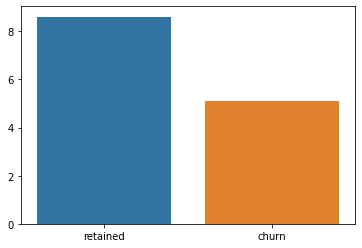

## Bussiness problem

  In this project I looked at SyriaTel’s customer data to predict churn, customers leaving the service. SyriaTel is a Syria based phone service provider, however we are only looking at the data of American customers.
  
 ##  Summary of findings
  
  The data shows that customers who leave, on average, make more customer service calls, make fewer but longer calls, and fewer voicemails than the customers who stay. No strong correlations were found between region, however customers who leave and live on the west coast make fewer calls than any other group (combination of region and churn or not).
  
  
  
  
  
  ## Random forests
  
  From the start of the modeling it was clear that the Random Forest Algorithm would be the way to go. The Random Forest and Boosted Random Forest methods were already doing decently without normalizing, feature engineering, or hypertuning. In contrast, the Decision Tree Algorithm was overfitting to the training data much more than the Random Forests. The SVM (Support Vector Machine) had the same problem.
  
  
  ## Scaling
  
  Moving on, it was time to scale the data. I tested between using Min-Max scaling and Standard-Scaling,  Standard-Scaling is subtracting the mean from each datapoint and dividing it by the standard deviation of the feature. Although Standard-Scaling had slightly lower accuracy than Min-Max, Min-Max had more overfitting and did worse than training on raw data. 
  
  
  ## Smoting
  
  After deciding to go with Standard-Scaling, the next step was to fix class imbalances. Only 10% of the customers in the dataset were labeled as churn. Because of this my model could label everything as not churn and still have 90% accuracy, this is why accuracy is often not the best metric, especially in binary classification problems like this one. My Gradient Boosted Random forest was already doing fine, but I was able to implement SMOTE, Synthetic Minority Oversampling Technique, for a near perfect recall and accuracy. In Summary, because I had about 3,000 non churn customers, 0, and 300 churn customers, 1, I generated ~2700 lookalike churn customers. This way the model would be penalized much more for mislabeling customers as 0 when they were really a 1.

Now we've got a bit of a precision issue, a lot of false positives.
  
  ## Feature Importance
  
 To make the model more efficiently I ran a feature importance test to identify which features had the most and least importance.

  After playing around with a few features I decided that it would be best to drop all the region columns, %evening calls, %night calls, and number of voicemails. This is because this combination produced 100% accuracy and recall, ability to label 1’s as 1’s in a binary classification problem.

## Feature Engineering

To make the model just a little bit better I generated 3 new features, total minutes, % international calls, and irregular calls (international calls + customer service calls), just to see if they were good enough to replace any of the remaining features. In the end they all had higher feature importance than 3 other features and was able to replace them.

## Final model

The Final model was a Gradient Boosted Random Forest with a max depth of 9, 250 trees, and a minimum of 2 samples per leaf. I came up with these parameters using sklearn’s GridSearchCV.

